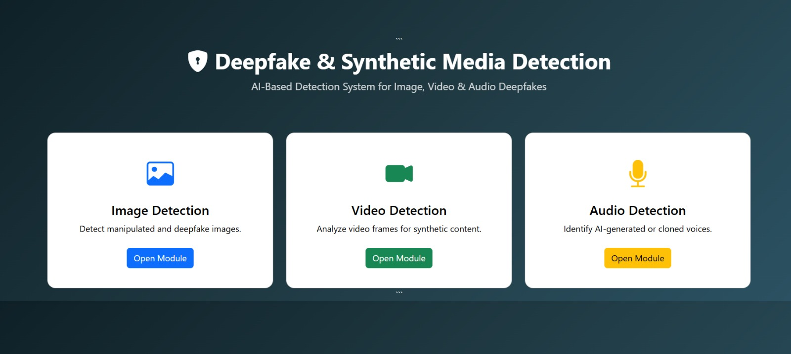
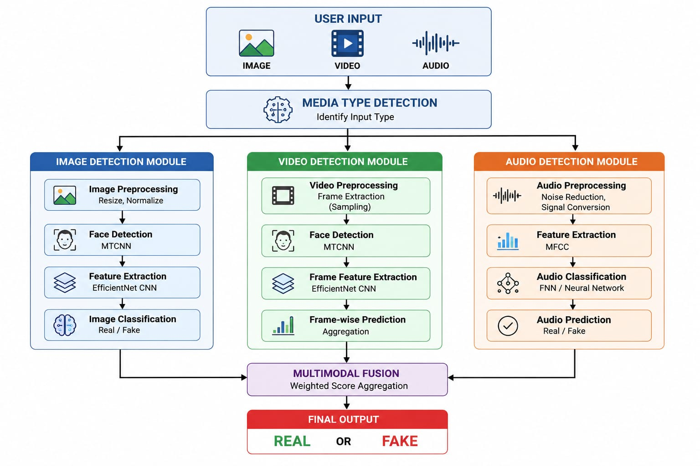
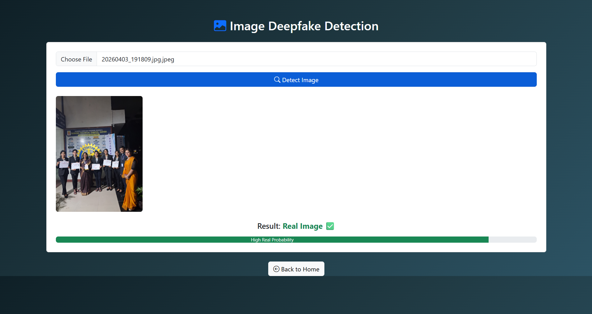
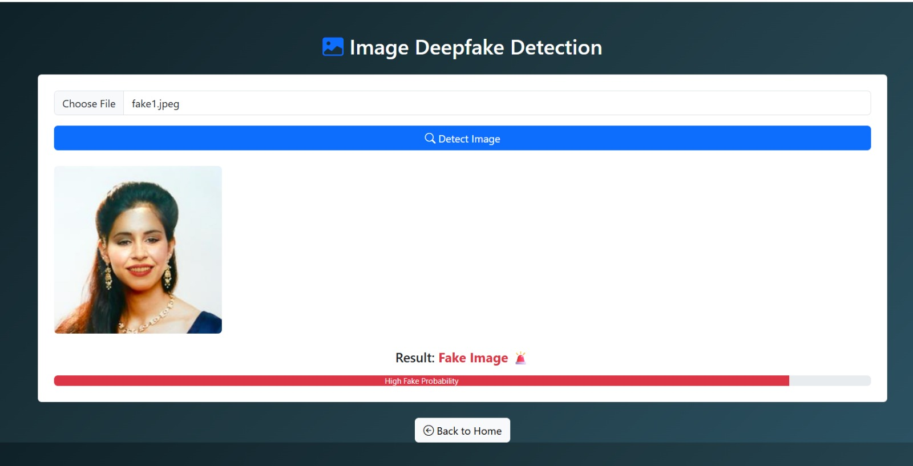
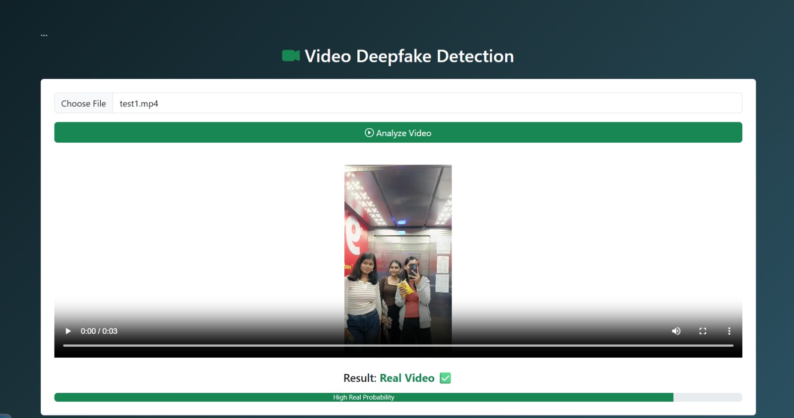
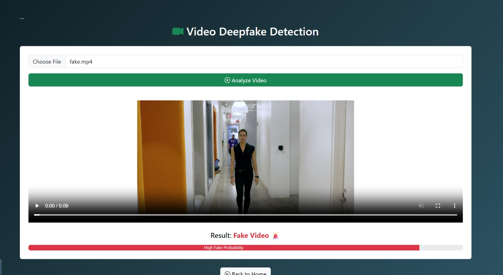
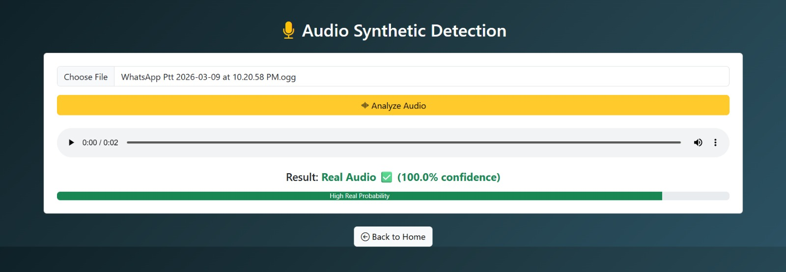
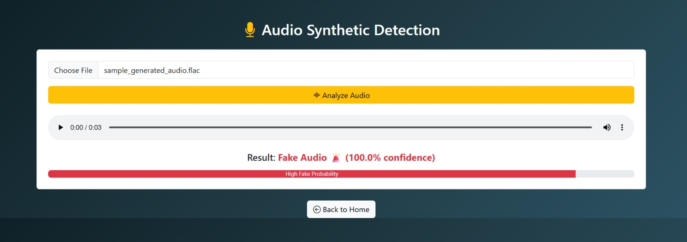

# Deepfake and Synthetic Media Detection

## Overview
Deepfake and Synthetic Media Detection is a multi-modal AI-based system designed to detect manipulated or synthetic media content across image, video, and audio formats. The project integrates separate detection modules into a unified Flask-based web application for media verification and analysis.

---

## Features
- Deepfake Image Detection
- Deepfake Video Detection
- Synthetic Audio Detection
- Flask-based Web Interface
- Upload and Analyze Media Files
- Modular Project Architecture
- Real/Fake Prediction Output

---

## Project Structure

``plaintext
Deepfake-and-Synthetic-media-detection/
│
├── audio/                 # Audio deepfake detection module
├── image_video/           # Image and video detection module
│   ├── preprocess/
│   ├── utils/
│   ├── models/
│   ├── train.py
│   ├── predictor.py
│   └── create_test_set.py
│
├── model/                 # Saved models
├── static/                # CSS, JS, images
├── templates/             # HTML templates
├── test_files/            # Sample testing files
│
├── app.py                 # Main Flask application
├── requirements.txt
├── README.md
└── .gitignore
```

---

## Technologies Used

- Python
- TensorFlow / Keras
- OpenCV
- Flask
- NumPy
- Librosa
- MTCNN
- CNN (Convolutional Neural Networks)

---

## Image & Video Detection Workflow

1. Extract frames from uploaded videos
2. Detect faces using MTCNN
3. Preprocess extracted faces
4. Predict whether media is Real or Fake using CNN model

---

## Audio Detection Workflow

1. Extract audio features
2. Process audio signals
3. Classify audio as Real or Synthetic using trained model

---

## Installation

### Clone Repository

```bash
git clone https://github.com/123456789044/Deepfake-and-Synthetic-media-detection.git
```

### Move to Project Folder

```bash
cd Deepfake-and-Synthetic-media-detection
```

### Install Dependencies

```bash
pip install -r requirements.txt
```

---

## Run the Application

```bash
python app.py
```

Open browser:

```plaintext
http://127.0.0.1:5000
```

---

## Dataset

Datasets and large media files are not uploaded due to GitHub size limitations.

### Kaggle Dataset Links

- Image & Video Dataset:  
  https://www.kaggle.com/datasets/ucimachinelearning/deep-fake-detection-cropped-dataset?resource=download

- Audio Dataset:  
  https://www.kaggle.com/datasets/your-audio-dataset-link

---

## Team Contributions

| Janhavi Lakeri |
 Samruddhi Shedage | 
 Shreya Ghadge |
 Rutuja Pawar |
 Snehal Pawar |

---

## Future Improvements

- Real-time deepfake detection
- Improved accuracy using transformer-based models
- Cloud deployment
- Live webcam detection
- Enhanced UI/UX

---

## Output

The system predicts whether uploaded media is:
- Real
- Fake / Synthetic

---

## Project Screenshots

| Home Page | Architecture Diagram |
|------------|----------------------|
|  |  |

---

| Real Image Prediction | Fake Image Prediction |
|-----------------------|-----------------------|
|  |  |

---

| Real Video Prediction | Fake Video Prediction |
|-----------------------|-----------------------|
|  |  |

---

| Real Audio Prediction | Fake Audio Prediction |
|----------------------|-----------------------|
|  |  |

---

## License

This project is developed for educational and research purposes.
